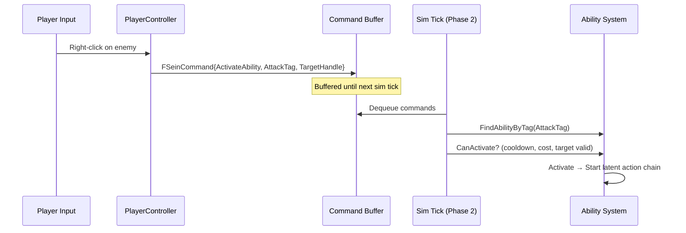

# Abilities

In SeinARTS, **everything is an ability**. Movement, attack, harvest, build, patrol, garrison — all player-issuable commands are abilities. There is no hardcoded command enum.

## Why?

A hardcoded command system forces you to modify C++ every time you add a new unit behavior. With abilities:

- Designers create new behaviors entirely in Blueprint
- Each ability encapsulates its own logic, targeting, and FX
- Abilities compose naturally (an ability can activate other abilities)
- The command buffer is uniform — every command is "activate ability X on target Y"

## Ability Classes

Abilities are `USeinAbility` subclasses — Blueprint classes, not data assets.

```cpp
UCLASS(Blueprintable, Abstract)
class USeinAbility : public UObject
{
    UPROPERTY(EditAnywhere, Category = "SeinARTS|Ability")
    FText AbilityName;

    UPROPERTY(EditAnywhere, Category = "SeinARTS|Ability")
    FGameplayTag AbilityTag;

    UPROPERTY(EditAnywhere, Category = "SeinARTS|Ability")
    FFixedPoint Cooldown;

    UPROPERTY(EditAnywhere, Category = "SeinARTS|Ability")
    TMap<FName, FFixedPoint> ResourceCost;

    UPROPERTY(EditAnywhere, Category = "SeinARTS|Ability")
    ESeinTargetType TargetType;  // None, Point, Entity, PointOrEntity

    UPROPERTY()
    FFixedPoint CooldownRemaining;

    UPROPERTY()
    bool bIsActive;

    UPROPERTY()
    bool bIsPassive;
};
```

### Key Properties

| Property | Description |
|----------|-------------|
| `AbilityTag` | Unique gameplay tag identifying this ability (e.g., `Ability.Attack.Ranged`) |
| `Cooldown` | Fixed-point cooldown duration in sim ticks |
| `ResourceCost` | Map of resource name → cost (e.g., `{"Manpower": 50, "Munitions": 25}`) |
| `TargetType` | What kind of target the ability needs |
| `bIsPassive` | If true, auto-activates and stays active (auras, passive buffs) |

## Latent Execution

Abilities don't execute in a single tick. They run as **latent actions** — cooperative coroutines managed by `USeinLatentActionManager`.

An ability's execution graph might look like:

```
MoveToAction (reach target)
  → WaitAction (wind-up time)
    → Apply Damage
      → WaitAction (cooldown)
        → Loop back to MoveToAction (for auto-attack)
```

Each latent action runs for as many ticks as it needs, then yields to the next. The latent action manager ticks all active actions each sim tick (Phase 3: Ability Execution).

### Built-in Latent Actions

| Action | Purpose |
|--------|---------|
| `USeinMoveToAction` | Pathfind and move to a target point or entity |
| `USeinWaitAction` | Wait for N sim ticks |

Designers can create custom latent actions in Blueprint for complex behaviors.

## Ability Component

Entities hold abilities via `FSeinAbilityComponent`:

```cpp
USTRUCT(BlueprintType)
struct FSeinAbilityComponent
{
    UPROPERTY(EditAnywhere, Category = "SeinARTS|Ability")
    TArray<TSubclassOf<USeinAbility>> GrantedAbilityClasses;

    UPROPERTY()
    TArray<USeinAbility*> AbilityInstances;
};
```

`GrantedAbilityClasses` is set on the archetype. At spawn, instances are created from these classes. Abilities can also be granted/revoked at runtime (e.g., veterancy unlocks a new ability).

### Querying Abilities

| Function | Description |
|----------|-------------|
| `FindAbilityByTag(Tag)` | Find an ability instance by its gameplay tag |
| `HasAbilityWithTag(Tag)` | Check if entity has a specific ability |

From the UI ViewModel:

```
EntityViewModel → GetAbilities() → TArray<FSeinAbilityInfo>
EntityViewModel → GetAbilityByTag(Tag) → FSeinAbilityInfo
EntityViewModel → HasAbilityWithTag(Tag) → bool
```

`FSeinAbilityInfo` is a display-friendly struct with name, icon, cooldown percent, active state, and resource cost already converted to floats.

## Command Flow



## Designing Abilities in Blueprint

1. Create a new Blueprint class derived from `USeinAbility`
2. Set the ability tag, cooldown, cost, target type in defaults
3. Override the execution graph using latent action nodes
4. Add the ability class to a unit's `GrantedAbilityClasses` array on its archetype

The ability automatically:

- Appears in the unit's ability bar (via `GetAbilities()`)
- Shows cooldown state in UI (via `FSeinAbilityInfo`)
- Validates resource costs before activation
- Enters the latent action manager when activated
- Fires visual events for the render layer

## Tips

!!! tip "Tag hierarchy for ability categories"
    Use tag hierarchy for organization: `Ability.Movement.Move`, `Ability.Attack.Ranged`, `Ability.Special.Heal`. This lets you query by category (e.g., "does this unit have any attack abilities?") using tag matching.

!!! sim "Abilities are sim-side objects"
    `USeinAbility` instances live in the simulation. They use `FFixedPoint` for cooldowns and costs. The `FSeinAbilityInfo` struct in the UI Toolkit is the render-friendly mirror — don't confuse the two.
