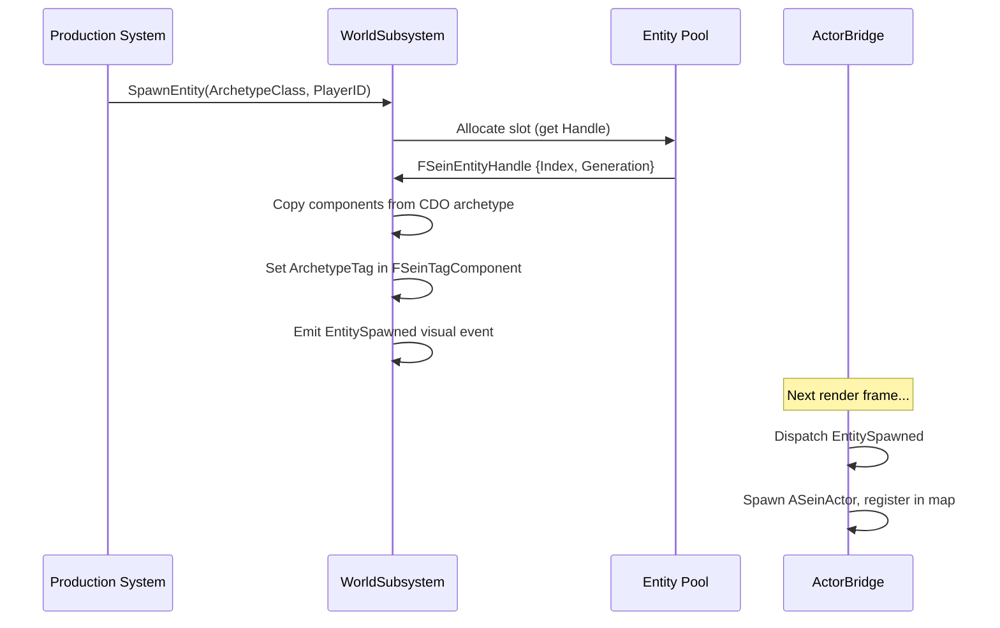

# Entities & Components

SeinARTS uses a custom Entity Component System (ECS) designed for deterministic simulation. This is separate from Unreal's Actor/Component model — the sim ECS is lightweight, pooled, and float-free.

## Entity Handles

An entity is identified by `FSeinEntityHandle`:

```cpp
USTRUCT(BlueprintType)
struct FSeinEntityHandle
{
    GENERATED_BODY()

    int32 Index;       // Slot in the entity pool
    int32 Generation;  // Incremented on reuse — prevents stale references
};
```

**Why generations?** Entity slots are recycled. When a unit dies, its slot returns to a free list. When a new unit spawns, it may reuse that slot. The generation counter ensures that a handle to the dead unit won't accidentally resolve to the new one.

Always check `IsValid()` before using a handle — it verifies the generation matches.

## Components

Components are plain `USTRUCT`s. No `UActorComponent`, no inheritance hierarchy, no virtual functions.

```cpp
USTRUCT(BlueprintType)
struct FSeinHealthComponent
{
    GENERATED_BODY()

    UPROPERTY(EditAnywhere, Category = "SeinARTS|Health")
    FFixedPoint MaxHealth;

    UPROPERTY(VisibleAnywhere, Category = "SeinARTS|Health")
    FFixedPoint CurrentHealth;
};
```

### Built-in Components

| Component | Fields | Purpose |
|-----------|--------|---------|
| `FSeinTagComponent` | BaseTags, GrantedTags, CombinedTags | Gameplay tag classification |
| `FSeinAbilityComponent` | GrantedAbilityClasses, AbilityInstances | Ability ownership |
| `FSeinActiveEffectsComponent` | ActiveEffects | Timed effects (buffs/debuffs) |
| `FSeinProductionComponent` | ProducibleClasses, Queue | Building production queue |
| `FSeinSquadComponent` | MemberIDs, SquadLeaderID | Squad membership |

### Custom Components

Define any `USTRUCT` and add it to your archetype. The framework discovers components via reflection — no registration required.

```cpp
USTRUCT(BlueprintType)
struct FSeinVeterancyComponent
{
    GENERATED_BODY()

    UPROPERTY(EditAnywhere, Category = "SeinARTS|Veterancy")
    FFixedPoint Experience;

    UPROPERTY(EditAnywhere, Category = "SeinARTS|Veterancy")
    int32 VeterancyLevel;

    UPROPERTY(EditAnywhere, Category = "SeinARTS|Veterancy")
    int32 MaxLevel = 3;
};
```

## Component Storage

Components are stored in typed arrays managed by `USeinWorldSubsystem`. Each component type has its own contiguous array, indexed by entity slot.

```
Entity Slot:   [0] [1] [2] [3] [4] ...
Health:        [✓] [✓] [✓] [ ] [✓]     ← not every entity has every component
Ability:       [✓] [✓] [ ] [ ] [✓]
Veterancy:     [ ] [✓] [ ] [ ] [ ]
```

Access components through the subsystem:

| Blueprint Node | Purpose |
|----------------|---------|
| `SeinGetComponent(Handle, StructType)` | Get a component by type |
| `SeinHasComponent(Handle, StructType)` | Check if entity has component |
| `SeinSetComponent(Handle, StructType, Data)` | Write component data |

Or via the ViewModel (render-side, read-only):

```
EntityViewModel → GetComponentData(StructType)
EntityViewModel → HasComponent(StructType)
```

## Archetypes and Spawning

### Blueprint IS the Unit

Each unit type is a Blueprint class derived from `ASeinActor`. The Blueprint's CDO (Class Default Object) carries a `USeinArchetypeDefinition` component that defines:

- **Display data**: Name, description, icon, portrait
- **Archetype tag**: Gameplay tag identifying this unit type
- **Components**: Map of `UScriptStruct* → FInstancedStruct` — the sim components this entity gets at spawn
- **Production data**: Cost, build time, prerequisites
- **Research data**: Whether this is a research item, what tech tag it grants

### Spawn Flow



## Entity Lifecycle

| State | Description |
|-------|-------------|
| **Alive** | Active in simulation, has valid components |
| **Pending Death** | Marked for destruction this tick |
| **Dead** | Slot recycled, generation incremented |

Dead entities emit `EntityDestroyed` visual events. The actor bridge keeps the actor alive briefly for death animations before cleanup.

## Tips

!!! sim "Never store raw pointers to components"
    Component arrays may reallocate. Always access components through the subsystem using the entity handle. Per-frame reads are cheap — the arrays are contiguous in memory.

!!! tip "Entity handles are value types"
    `FSeinEntityHandle` is a small struct — pass by value, store in arrays, use as map keys. The generation counter makes them safe to hold across frames.
