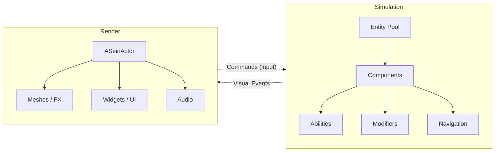

# Architecture

This page explains the foundational mental model of SeinARTS. Understanding the sim/render split is essential before building anything with the framework.

## The Two Worlds

SeinARTS separates your game into two distinct layers:



### The Simulation Layer

<span class="tag sim">SIM</span>

The simulation is the *truth*. It runs at a fixed tick rate, uses only fixed-point math (`FFixedPoint`, 32.32 format), and is completely deterministic. Two machines processing the same command stream will produce identical state, bit-for-bit.

**The sim never:**

- Uses `float`, `FVector`, `FMath`, `FRotator`, or any UE floating-point type
- References `AActor*`, `UObject*`, or any garbage-collected pointer
- Calls `FMath::Rand()`, `FMath::RandRange()`, or any non-deterministic RNG
- Accesses the network, file system, or system clock

**The sim uses:**

- `FFixedPoint` for all scalar math
- `FFixedVector`, `FFixedQuat`, `FFixedTransform` for spatial math
- `FSeinEntityHandle` (index + generation) for entity references
- `FSeinSimContext` for deterministic PRNG and tick state

### The Render Layer

<span class="tag render">RENDER</span>

The render layer is Unreal Engine doing what Unreal does best — drawing things. `ASeinActor` instances represent entities visually. They read from the sim each frame to interpolate positions, play animations, update UI, and spawn effects.

**Data flows one way: sim &rarr; render.** Render code never writes back into sim state. Player input goes through the command buffer, which the sim processes on the next tick.

### Visual Events

When something significant happens in the sim (entity spawned, entity died, ability activated, damage dealt), it emits a **visual event**. The `USeinActorBridgeSubsystem` collects these events during the sim tick and dispatches them to the render layer after the tick completes.

```
Sim Tick
  └─ Entity takes damage
     └─ Emits FSeinVisualEvent { Type: DamageDealt, Source, Target, Value }

Render Frame
  └─ ActorBridge dispatches event
     └─ ASeinActor::HandleVisualEvent()
        └─ Spawns hit FX, plays sound, flashes health bar
```

This ensures the sim stays clean and the render layer has all the context it needs to present things beautifully.

## Entities and Components

Entities are lightweight handles, not UObjects. An entity is an `FSeinEntityHandle` — a 32-bit index plus a generation counter for safe pooling.

Components are plain `USTRUCT`s stored in typed arrays:

```cpp
// Define a component — just a USTRUCT
USTRUCT(BlueprintType)
struct FSeinHealthComponent
{
    GENERATED_BODY()

    UPROPERTY(EditAnywhere, Category = "SeinARTS|Health")
    FFixedPoint MaxHealth;

    UPROPERTY(VisibleAnywhere, Category = "SeinARTS|Health")
    FFixedPoint CurrentHealth;
};
```

Components are registered on `USeinArchetypeDefinition` (which lives on the Blueprint CDO). At spawn time, the entity pool allocates slots and copies component data from the archetype.

## Sim Tick Phases

Each simulation tick runs four phases in order:

| Phase | What Happens |
|-------|-------------|
| **1. Pre-Tick** | Cooldown reduction, effect expiration, modifier cleanup |
| **2. Command Processing** | Dequeue player/AI commands, activate/cancel abilities |
| **3. Ability Execution** | All active abilities tick via the latent action manager |
| **4. Post-Tick** | Cleanup dead entities, recycle pooled slots, compute state hash |

The state hash at the end of Post-Tick is used for determinism validation — if two clients disagree on the hash, there's a desync.

## Key Subsystems

| Subsystem | Layer | Role |
|-----------|-------|------|
| `USeinWorldSubsystem` | Sim | Entity pool, component storage, attribute resolution, tick orchestration |
| `USeinActorBridgeSubsystem` | Bridge | Entity &harr; Actor mapping, visual event dispatch |
| `USeinUISubsystem` | Render | ViewModel lifecycle, selection model, per-tick UI refresh |

## Next Steps

- [UI Toolkit Guide](../guides/ui-toolkit.md) — Build a unit info panel using the ViewModel pattern
- [Sim/Render Separation](../concepts/sim-render.md) — Deep dive into the boundary rules
- [Entities & Components](../concepts/entities.md) — How the ECS works
