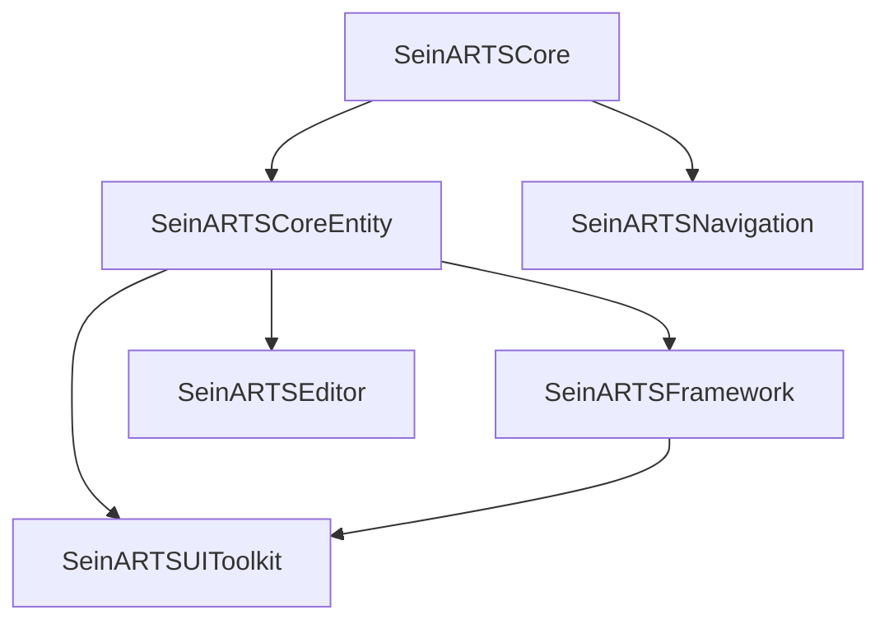

# Installation

## Adding the Plugin

1. **Copy the plugin folder** into your project's `Plugins/` directory:

    ```
    YourProject/
    └── Plugins/
        └── SeinARTSFramework/
            ├── SeinARTSFramework.uplugin
            ├── Source/
            ├── Content/
            └── Resources/
    ```

2. **Regenerate project files** — right-click your `.uproject` file and select *Generate Visual Studio project files* (or use your IDE's equivalent).

3. **Build the project** — open the `.sln` and build, or launch the editor (which triggers a build automatically).

## Verifying the Installation

Open the editor and check that all modules loaded:

1. Go to **Edit > Plugins**
2. Search for "SeinARTS"
3. You should see the plugin enabled with all six modules listed

Alternatively, open the **Output Log** and search for `SeinARTS`. You should see module load messages for each module.

## Module Dependencies

The plugin is self-contained. The modules depend on each other in this order:



Your game module only needs to depend on the modules you directly reference. For most projects, adding `SeinARTSFramework` and `SeinARTSUIToolkit` to your `.Build.cs` is sufficient — they transitively pull in everything else.

```csharp
// YourGame.Build.cs
PublicDependencyModuleNames.AddRange(new string[]
{
    "SeinARTSFramework",
    "SeinARTSUIToolkit",
});
```

## Project Setup

### Game Mode

Set your project's default Game Mode to `ASeinGameMode` (or a Blueprint subclass of it). This ensures the correct player controller, HUD, and camera pawn are spawned.

In **Project Settings > Maps & Modes**:

- **Default GameMode**: `SeinGameMode` (or your BP subclass)

### Player Controller

`ASeinPlayerController` handles:

- Selection (click, marquee, double-click-select-type)
- Control groups (Ctrl+0–9 to assign, 0–9 to recall)
- Command input (right-click orders, ability hotkeys)
- Camera control delegation

### HUD

`ASeinHUD` provides:

- Marquee selection box rendering
- Drag-order line rendering
- `HUDLayoutWidgetClass` property — assign a Widget Blueprint here to auto-create your root HUD widget on BeginPlay

### Camera

`ASeinCameraPawn` provides an RTS-style camera with edge-scroll, WASD, and zoom. Configure speeds and bounds in its Blueprint defaults.

## Next Steps

Now that the plugin is installed, read [Architecture](architecture.md) to understand the sim/render mental model before building anything.
