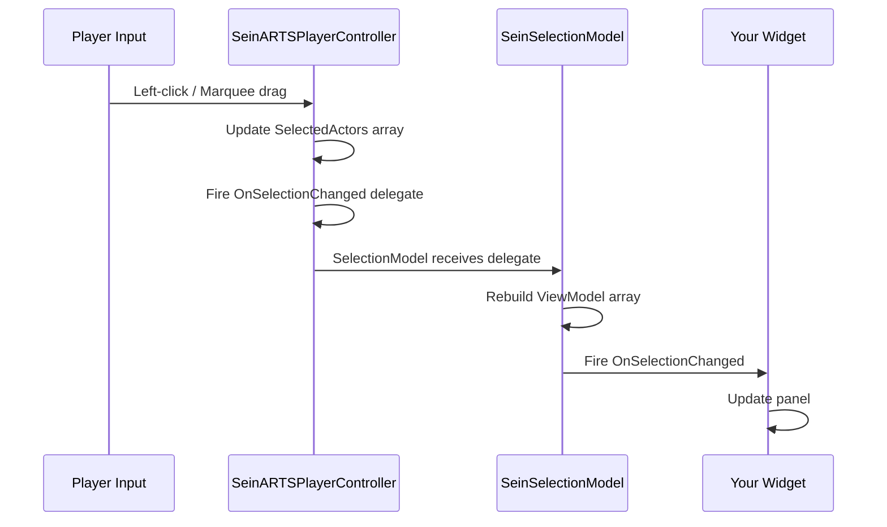

# Selection & Control Groups

This guide covers how selection state flows through the framework — from mouse input to UI updates — and how to build multi-unit selection panels and control group displays.

## How Selection Works

### Input Flow



### Selection State

`ASeinARTSPlayerController` manages the raw selection:

| Property | Type | Description |
|----------|------|-------------|
| `SelectedActors` | `TArray<ASeinActor*>` | Currently selected actors |
| `ActiveFocusIndex` | `int32` | Which unit in the selection is "focused" (Tab to cycle) |

`USeinSelectionModel` (in the UI Toolkit) wraps this with ViewModel access:

| Function | Returns | Description |
|----------|---------|-------------|
| `GetSelectedViewModels()` | `TArray<USeinEntityViewModel*>` | ViewModels for all selected entities |
| `GetPrimaryViewModel()` | `USeinEntityViewModel*` | First selected entity (drives single-unit panels) |
| `GetFocusedViewModel()` | `USeinEntityViewModel*` | The entity at `ActiveFocusIndex` |
| `GetSelectionCount()` | `int32` | Number of selected entities |
| `GetActiveFocusIndex()` | `int32` | Current focus index |
| `IsEntitySelected(Handle)` | `bool` | Check if a specific entity is selected |
| `IsEntityFocused(Handle)` | `bool` | Check if a specific entity is focused |

## Building a Multi-Unit Selection Panel

A multi-unit panel (like the portrait grid in Company of Heroes) shows all selected units as clickable portraits.

### Pattern

```
Bind to SelectionModel → OnSelectionChanged

OnSelectionChanged:
  → GetSelectedViewModels()
  → For Each ViewModel:
      → Create or reuse a portrait widget
      → Set portrait image (SeinGetEntityPortrait)
      → Set health bar (GetResolvedAttribute for CurrentHealth/MaxHealth)
      → Highlight if IsFocused
  → Hide unused portrait slots
```

### Focus Cycling

When the player presses Tab, the controller increments `ActiveFocusIndex` and fires `OnSelectionChanged`. Your multi-unit panel should:

1. Remove the highlight from the old focused portrait
2. Add the highlight to the new focused portrait
3. Update the single-unit detail panel (unit info, abilities) to show the newly focused entity

The `SelectionModel` handles the index math — just call `GetFocusedViewModel()` and `IsEntityFocused(Handle)`.

## Control Groups

Control groups let players save and recall selections using number keys.

### Setting Control Groups

| Input | Action |
|-------|--------|
| ++ctrl+0++ through ++ctrl+9++ | Assign current selection to group |
| ++0++ through ++9++ | Recall group (replace selection) |

### Accessing Control Group Data

From Blueprint, use the player controller getters:

```
GetControlGroup(GroupIndex)    → TArray<FSeinEntityHandle>
GetControlGroupCount(GroupIndex) → int32
```

### Building a Control Group Display

A control group HUD element (small numbered boxes showing group contents) follows this pattern:

```
For GroupIndex 0 to 9:
  → GetControlGroupCount(GroupIndex)
  → Branch: Count > 0?
    ├─ True:  Show group indicator
    │         Set count text
    │         Optionally show first unit's icon
    └─ False: Hide group indicator
```

Refresh this on `OnSelectionChanged` or bind it to a short timer (control group contents change infrequently).

## Entity Relationship Display

For multi-select panels showing mixed friendly/enemy units (e.g., after marquee-selecting during a battle), use the relation API:

```
ViewModel → GetRelationToLocalPlayer()
  → Returns ESeinRelation: Friendly, Enemy, Neutral
```

Use this to:

- Color-code portrait borders (green/red/yellow)
- Filter which units show in the command panel
- Determine which context-menu actions are available

## Tips

!!! tip "Subgroup by type"
    For CoH-style selection, group the `GetSelectedViewModels()` array by `ArchetypeTag` before displaying. Show one row per unit type with a count badge, rather than individual portraits for large selections.

!!! tip "Performance with large selections"
    `USeinWorldWidgetPool` is ideal for the portrait grid. Initialize a pool of portrait widgets and acquire/release as the selection changes. This avoids widget creation/destruction churn when rapidly selecting and deselecting.

## Next Steps

- [Creating a Unit Info Panel](unit-info-panel.md) — Detailed single-unit panel tutorial
- [UI Toolkit Guide](ui-toolkit.md) — ViewModel pattern overview
