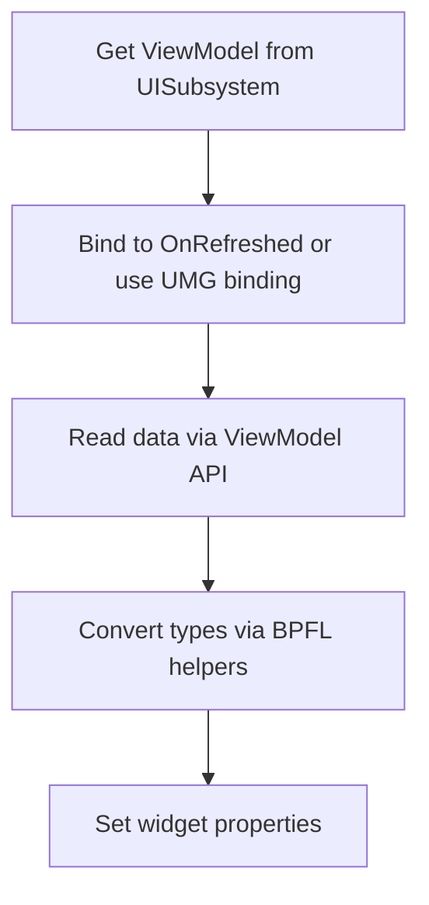

# Building UI with the Toolkit

This guide introduces the SeinARTS UI Toolkit — the ViewModel-based data binding layer that connects your sim data to Blueprint Widget Blueprints. By the end, you'll understand how ViewModels work, the two binding strategies, and how to structure any RTS panel.

## The Problem

Your simulation runs on fixed-point math with entity handles and component structs. Your UI runs on UMG with floats, strings, and textures. Something needs to bridge that gap cleanly, without forcing every widget to manually query subsystems and convert types.

## The Solution: ViewModels

The UI Toolkit provides three **ViewModels** — lightweight objects that cache sim data each tick and expose it as Blueprint-friendly properties:

| ViewModel | What It Represents | Key API |
|-----------|-------------------|---------|
| `USeinEntityViewModel` | A single sim entity | `GetResolvedAttribute()`, `GetComponentData()`, `GetAbilities()`, `GetRelationToLocalPlayer()` |
| `USeinPlayerViewModel` | A player's state | `GetResource()`, `GetAllResources()`, `HasTechTag()`, `CanAfford()` |
| `USeinSelectionModel` | Current selection state | `GetSelectedViewModels()`, `GetPrimaryViewModel()`, `GetFocusedViewModel()` |

All three are managed by `USeinUISubsystem`, which:

- Creates and caches ViewModels on demand
- Refreshes all active ViewModels every sim tick
- Cleans up stale entity ViewModels automatically

You never construct ViewModels yourself — always get them from the subsystem.

## Two Ways to Bind Data

### Option A: UMG Property Binding (Polling)

UMG natively supports binding widget properties to Blueprint variables. You can:

1. Add a variable to your Widget Blueprint (e.g., `float HealthPercent`)
2. Bind a Progress Bar's `Percent` to that variable
3. Update the variable in an event handler

UMG polls bound properties every frame, so the widget updates automatically. This is the simplest approach and requires zero event wiring for display-only data.

### Option B: Event-Driven Binding

Every ViewModel fires an `OnRefreshed` delegate after each sim tick update. You can bind to this event and push data into your widget explicitly:

```
Event OnRefreshed
  → Get ViewModel → Get Resolved Attribute (HealthComponent, CurrentHealth)
  → Convert to Float → Set Progress Bar Percent
```

This is better when you need to:

- Trigger animations or sounds on value changes
- Compare old vs. new values
- Conditionally update (e.g., only when visible)

### Which Should I Use?

For most panels, **use both**. Bind display-only values via UMG property binding (simple, zero wiring). Use `OnRefreshed` for logic that reacts to changes (flash the health bar red when HP drops, play a sound when a tech unlocks).

## Accessing the Toolkit

### From Any Widget Blueprint

If your widget extends `USeinUserWidget` (recommended), you get convenience accessors:

| Function | Returns |
|----------|---------|
| `GetSelectionModel()` | The selection model |
| `GetLocalPlayerViewModel()` | Local player's ViewModel |
| `GetEntityViewModel(Handle)` | ViewModel for any entity |
| `GetActorBridge()` | The actor bridge subsystem |

These are cached on widget construction — no per-frame lookups.

### From Any Blueprint (via BPFL)

All UI utility functions are available globally via `USeinUIBPFL`:

- **Display helpers**: `SeinGetEntityDisplayName`, `SeinGetEntityIcon`, `SeinGetEntityPortrait`
- **Conversion**: `SeinFixedToFloat`, `SeinFixedVectorToVector`, `SeinFormatResourceCost`
- **Screen projection**: `SeinWorldToScreen`, `SeinScreenToWorld`, `SeinIsEntityOnScreen`
- **Minimap math**: `SeinWorldToMinimap`, `SeinMinimapToWorld`, `SeinGetCameraFrustumCorners`
- **Action slots**: `SeinBuildAbilitySlotData`, `SeinBuildProductionSlotData`

## The General Pattern

Every RTS panel follows the same workflow:



1. **Get a ViewModel** — from `USeinUserWidget` accessors or `USeinUISubsystem` directly
2. **Bind** — subscribe to `OnRefreshed` and/or set up UMG property bindings
3. **Read** — use ViewModel getters (`GetResolvedAttribute`, `GetResource`, etc.)
4. **Convert** — use BPFL helpers to go from sim types to display types
5. **Display** — set text, progress bars, images, visibility

## Accessing Arbitrary Component Data

The ViewModel doesn't prescribe which components exist. Use `GetComponentData()` to read any component struct by type:

```
Get Component Data (USeinHealthComponent::StaticClass())
  → Break Struct
  → Get "CurrentHealth" → SeinFixedToFloat → Set Text
```

This works with *any* USTRUCT component — health, armor, veterancy, resource yield, custom components you define. The toolkit doesn't need to know about them in advance.

## Resolved vs. Base Attributes

Two ways to read numeric fields:

- **`GetResolvedAttribute(StructType, FieldName)`** — Returns the final value after all modifiers (base + archetype modifiers + instance modifiers). Use this for display.
- **`GetBaseAttribute(StructType, FieldName)`** — Returns the raw value before modifiers. Use this for tooltips showing "base damage" vs. "modified damage".

Both return `float` (already converted from `FFixedPoint`).

## Handling Selection Changes

The `USeinSelectionModel` tracks what the player has selected and provides entity ViewModels for the selection:

```
Bind to SelectionModel → OnSelectionChanged

Event OnSelectionChanged:
  → Get Selected ViewModels (array of USeinEntityViewModel)
  → Get Primary ViewModel (first selected, drives single-unit panels)
  → Get Focused ViewModel (active focus, cycles with Tab)
  → Update your panel widgets
```

The selection model auto-binds to the player controller's `OnSelectionChanged` delegate. You don't need to wire that up manually.

## World-Space Widgets

For per-entity UI (health bars above units, floating damage numbers), use `USeinWorldWidgetPool`:

1. Create a panel widget in your HUD as a container
2. Create a widget class for the per-entity element (e.g., health bar)
3. Initialize the pool: `Initialize(ContainerPanel, WidgetClass, PoolSize)`
4. Each frame, acquire widgets for visible entities and release them when entities leave screen

The pool handles widget recycling via visibility toggling — no create/destroy overhead.

## Next Steps

- [Creating a Unit Info Panel](unit-info-panel.md) — Step-by-step tutorial building a complete unit frame
- [Selection & Control Groups](selection.md) — How selection state flows through the system
- [BP Node Reference: UI Toolkit](../reference/ui-toolkit.md) — Every exposed function
