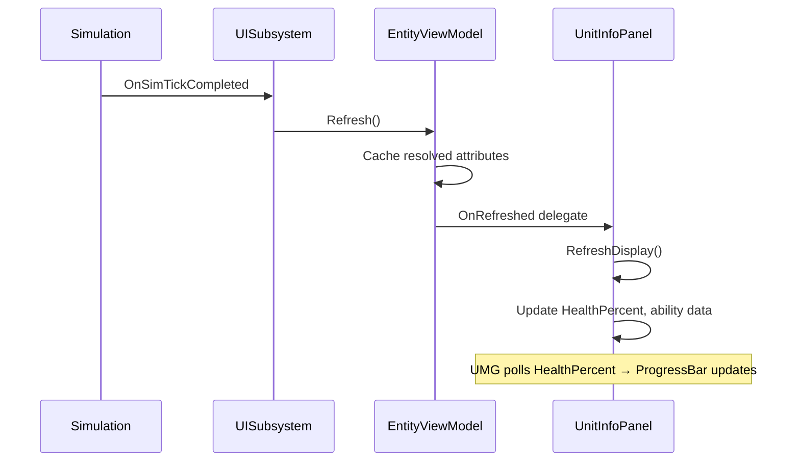

# Creating a Unit Info Panel

This tutorial walks through building a complete unit info panel — the panel that shows a selected unit's portrait, name, health, and abilities. This is the most common first UI element in any RTS.

## What We're Building

A panel that displays:

- Unit portrait and name
- Health bar with current/max values
- Armor type tag
- List of ability buttons with cooldown overlays

The panel binds to the **focused entity** in the selection (the one highlighted in the selection group, typically the first selected or the one the player cycles to with Tab).

## Step 1: Create the Widget Blueprint

1. In the Content Browser, right-click and choose **User Interface > Widget Blueprint**
2. Name it `WBP_UnitInfoPanel`
3. Set the parent class to `SeinUserWidget`

!!! tip "Why SeinUserWidget?"
    `SeinUserWidget` auto-caches references to `USeinUISubsystem`, `USeinWorldSubsystem`, and `ASeinPlayerController` on construction. You get `GetSelectionModel()`, `GetLocalPlayerViewModel()`, etc. without any setup.

## Step 2: Layout the UI

In the Widget Designer, build your layout. A simple version:

```
[Vertical Box]
  ├─ [Horizontal Box]           ← Header row
  │   ├─ [Image] PortraitImage
  │   └─ [Vertical Box]
  │       ├─ [Text] UnitNameText
  │       └─ [Text] ArmorTypeText
  ├─ [Progress Bar] HealthBar
  ├─ [Text] HealthValueText     ← "850 / 1200"
  └─ [Horizontal Box]           ← Ability buttons
      ├─ [WBP_AbilityButton] x6
```

## Step 3: Add Variables

Add these variables to the Widget Blueprint:

| Variable | Type | Purpose |
|----------|------|---------|
| `CachedViewModel` | `USeinEntityViewModel` (Object Reference) | Currently bound entity ViewModel |
| `HealthPercent` | `Float` | For UMG progress bar binding |
| `UnitName` | `Text` | For UMG text binding |

## Step 4: Bind to Selection Changes

In the **Event Graph**:

```
Event Construct (NativeConstruct)
  → Get Selection Model
  → Bind Event to OnSelectionChanged → [Custom Event: OnSelectionUpdated]
```

Then handle the selection update:

```
OnSelectionUpdated:
  → Get Selection Model → Get Focused View Model
  → Set CachedViewModel
  → Branch: Is Valid?
    ├─ True:  Set Visibility (Self Visible)
    │         → Bind to CachedViewModel.OnRefreshed → [RefreshDisplay]
    └─ False: Set Visibility (Collapsed)
              → Unbind from previous OnRefreshed
```

## Step 5: Refresh Display

Create a `RefreshDisplay` custom event that reads from the ViewModel:

```
RefreshDisplay:
  → CachedViewModel → Get Resolved Attribute
        Struct: FSeinHealthComponent
        Field: "CurrentHealth"
    → Store as CurrentHP (float)

  → CachedViewModel → Get Resolved Attribute
        Struct: FSeinHealthComponent
        Field: "MaxHealth"
    → Store as MaxHP (float)

  → Set HealthPercent = CurrentHP / MaxHP
  → Set HealthValueText = Format("{0} / {1}", Floor(CurrentHP), Floor(MaxHP))
```

### Portrait and Name

These don't change per-tick, so set them once in `OnSelectionUpdated`:

```
→ SeinGetEntityDisplayName(Handle) → Set UnitNameText
→ SeinGetEntityPortrait(Handle) → Set PortraitImage Brush
→ SeinGetEntityArchetypeTag(Handle) → Get Tag Display Name → Set ArmorTypeText
```

### UMG Property Binding

For `HealthBar`, use UMG's built-in binding:

1. Select the Progress Bar in the designer
2. Click **Bind** next to the `Percent` property
3. Choose `HealthPercent` variable

The progress bar now updates automatically whenever `HealthPercent` changes — no manual `SetPercent` call needed.

## Step 6: Ability Buttons

For each ability slot, use the BPFL helper:

```
RefreshDisplay (continued):
  → SeinBuildAllAbilitySlotData(WorldContext, EntityHandle)
  → Returns TArray<FSeinActionSlotData>
  → For Each: update ability button widgets
      → Set Icon, Tooltip, Cooldown Percent, State (Available/OnCooldown/Disabled)
```

`FSeinActionSlotData` contains everything a button needs:

| Field | Type | Use |
|-------|------|-----|
| `Name` | FText | Button tooltip header |
| `Icon` | UTexture2D* | Button icon |
| `State` | ESeinActionSlotState | Available, OnCooldown, Disabled, etc. |
| `CooldownPercent` | float | 0–1, drives cooldown sweep overlay |
| `ResourceCost` | TMap&lt;FName, float&gt; | Cost display |
| `HotkeyLabel` | FText | Keyboard shortcut label |

## Step 7: Add to HUD

Two options:

**Option A — Via HUD class:**
Set `ASeinHUD::HUDLayoutWidgetClass` to a root layout widget that contains `WBP_UnitInfoPanel`.

**Option B — Direct add:**
In your HUD layout widget, add `WBP_UnitInfoPanel` as a child in the designer.

## Complete Data Flow



## Tips

!!! sim "Always use resolved attributes for display"
    `GetResolvedAttribute()` includes all active modifiers (veterancy bonuses, aura buffs, tech upgrades). `GetBaseAttribute()` is only for showing the unmodified base value in tooltips.

!!! render "Don't tick your widgets"
    There's no need to override `NativeTick` on your widget. The ViewModel's `OnRefreshed` fires once per sim tick, which is your update cadence. Polling via UMG binding handles the render-frame interpolation for free.

!!! tip "Handle invalidation"
    When an entity dies, the ViewModel fires `OnInvalidated`. Unbind your display and hide the panel. The UISubsystem will garbage-collect the ViewModel after a short delay.

## Next Steps

- [Selection & Control Groups](selection.md) — Multi-select panels, subgroup display
- [BP Node Reference: UI Toolkit](../reference/ui-toolkit.md) — Full API listing
