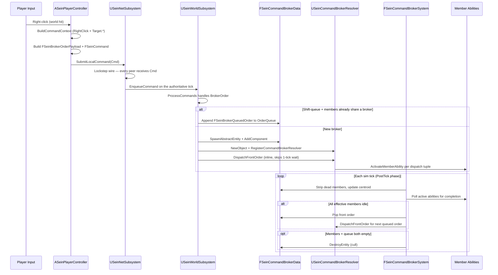

# Order Lifecycle

<span class="tag sim">SIM</span> One player click → one transaction-log entry → one or more per-member ability activations. This page walks the full path: input event, command emission, broker spawn / reuse, resolver dispatch, tick-driven completion, queue advancement, and self-cull.

## The full path



## Step-by-step

### 1. Input → command context

`ASeinPlayerController::IssueSmartCommandEx(WorldLocation, TargetActor, bQueue, FormationEnd)` is the gameplay-layer entry point. It:

1. Calls `BuildCommandContext(TargetActor, WorldLocation)` (a `BlueprintNativeEvent`) to translate the cursor hit into a tag container — `RightClick` + one of `Target.Ground` / `Target.Friendly` / `Target.Neutral` / `Target.Enemy`. Override this in a Blueprint subclass to add project-specific context tags (e.g., `Target.Building`, `Target.Damaged`).
2. Resolves the command target set — if `ActiveFocusIndex` is set (Tab-cycled focus), the focused unit only; otherwise all valid selected actors.
3. Converts each `ASeinActor*` to its `FSeinEntityHandle` via `Actor->GetEntityHandle()`.

Wraps the result in a payload + command:

```cpp
FSeinBrokerOrderPayload Payload;
Payload.CommandContext = Context;        // RightClick + Target.*
Payload.FormationEnd   = FixedFormationEnd;  // Drag-order endpoint, zero if not a drag

FSeinCommand BrokerCmd;
BrokerCmd.PlayerID      = SeinPlayerID;
BrokerCmd.CommandType   = SeinARTSTags::Command_Type_BrokerOrder;
BrokerCmd.TargetEntity  = TargetEntityHandle;
BrokerCmd.TargetLocation = FixedLocation;
BrokerCmd.EntityList    = MemberHandles;
BrokerCmd.bQueueCommand = bQueue;
BrokerCmd.Payload       = FInstancedStruct::Make(Payload);
```

### 2. Lockstep wire

`USeinNetSubsystem::SubmitLocalCommand(BrokerCmd)` ships the command across the lockstep transport. Standalone bypasses the wire and goes straight to `USeinWorldSubsystem::EnqueueCommand`; networked builds cross the wire and the server stamps the authoritative tick from the source relay.

The full broker order — payload + member list + click context — is **one txn entry**. Every connected peer's sim sees the same command on the same tick. Per-member ability activations are **internal** to each peer's sim; they never cross the wire.

### 3. ProcessCommands → broker spawn or reuse

`USeinWorldSubsystem::ProcessCommands` runs in the CommandProcessing tick phase. For each `BrokerOrder` command:

1. **Filter by ownership**. Walk `Cmd.EntityList`, drop any handle not owned by `Cmd.PlayerID` (single-owner invariant). Match-settings `bAlliedCommandSharing` widens the filter to allies that grant `Permission.CommandSharing` — but the broker's owner stays `Cmd.PlayerID`.
2. **Validate the payload**. Extract `FSeinBrokerOrderPayload` from `Cmd.Payload`. Missing payload = malformed command, rejected.
3. **Build `FSeinBrokerQueuedOrder`** from the command + payload (Context, TargetEntity, TargetLocation, FormationEnd).
4. **Reuse vs. spawn**:
   - If `Cmd.bQueueCommand == true` and **every filtered member already shares the same broker**, append the order to that broker's queue.
   - If the filtered set is a strict subset of the shared broker's live members, mark the appended order's `TargetMembers` so only those members dispatch for it (subset-targeted, see below).
   - Otherwise (no shared broker, or non-shift click): call `CreateBrokerForMembers(Filtered, PlayerID, FirstOrder)`.

`CreateBrokerForMembers` evicts each member from its prior broker (the "one broker per member" invariant — old brokers cull automatically if their queue + member set both empty), spawns an abstract entity at the centroid, instantiates the resolver class from plugin settings, registers it in `CommandBrokerResolverPool`, and pre-queues the first order.

### 4. Inline first-order dispatch

After `CreateBrokerForMembers` adds the broker component, it calls `DispatchFrontOrder` **inline** (synchronously, on the same command-processing tick). This skips the one-tick wait that would otherwise occur if dispatch only happened in the broker system's PostTick pass — players expect their click to take effect immediately, not next sim tick.

`DispatchFrontOrder` does:

1. Build `EffectiveMembers` — the subset the front order targets, or the broker's full member list if unscoped.
2. Rebuild the capability map if dirty.
3. Call `Resolver->ResolveDispatch(World, BrokerHandle, OrderInput)`.
4. Stamp `bIsExecuting = true`, `Anchor = FirstOrder.TargetLocation`, `CurrentOrderContext = FirstOrder.Context`.
5. Walk `Plan.MemberDispatches`, calling `ActivateMemberAbility(World, MD)` per tuple.

`ActivateMemberAbility` runs the ability's normal cooldown + `CanActivate` gates, applies tag-based cancel-others, then fires `Ability->ActivateAbility(TargetEntity, TargetLocation)`. **Cost is NOT re-deducted** — the broker-level order represents the one player click that already paid through the normal `ProcessCommands` activation path (or in `AutoMoveThen`, paid upfront at acceptance time). Per-member cost duplication is undefined at V1; designers can deduct in `OnActivate` if a per-member cost is needed.

### 5. PostTick: completion + queue advancement

`FSeinCommandBrokerSystem` runs in the PostTick phase, priority 40 (before the state-hash system). For each broker entity, per tick:

1. **Strip dead members**. Walk `Members`, remove any handle whose entity pool slot is invalid. Mark capability map dirty if the list shrunk. Also strip dead handles from each queued order's `TargetMembers` — subset orders whose every target died fall through to the empty-subset guard and get popped silently.
2. **Update centroid**. Sum live member positions, divide by count.
3. **Completion check**. If `bIsExecuting`, walk the front order's `EffectiveMembers` and check whether each one's primary ability has ended. Subset-targeted orders only wait on their target members; non-target members can be doing anything (or nothing) without blocking. Passive abilities aren't tracked as "active" for completion — DESIGN §5: members only ever execute one active ability at a time per broker order.
4. **Pop + dispatch next**. If all effective members are idle, clear `bIsExecuting`, clear `CurrentOrderContext`, pop the front order, and (if the queue is non-empty) immediately call `DispatchFrontOrder` for the new front.
5. **Cull**. If `Members.Num() == 0 && OrderQueue.Num() == 0 && !bIsExecuting`, queue the broker for `DestroyEntity`. The actual cull happens after the `ForEachEntity` walk to avoid mutating the pool mid-iteration.

## Shift-queue semantics

`bQueueCommand = true` (held shift on the click) opens the queue path:

- **Same selection, shift-click again** → append to the shared broker's queue. The broker keeps executing the current order; the new order fires when the current one completes.
- **Subset of a shared broker's members selected, shift-click** → append a subset-targeted order. Only the subset members dispatch for the new order; non-subset members keep doing the previous order (or stay idle if the previous one is done).
- **Different selection (no shared broker), shift-click** → spawns a new broker for that selection, evicting any members from prior brokers per the one-broker-per-member invariant. The "queue" intent is honored within the new broker's first order, but cross-broker queueing is not a primitive — by design, a player can't shift-chain orders across two disjoint groups in one selection.

## AutoMoveThen integration

When a player issues an `ActivateAbility` command directly (not via the broker path) and the target is out-of-range with `OutOfRangeBehavior == AutoMoveThen`, the framework synthesizes a broker on the fly:

1. Validates the entity has a `Move` ability (else rejects as `OutOfRange`).
2. Deducts the original ability's cost upfront — AutoMoveThen is "accept this command," not a free pass.
3. Resolves the move destination — the target entity's current location, or `Cmd.TargetLocation` for ground targets.
4. Builds two `FSeinBrokerQueuedOrder` entries:
   - **Move prefix** — `bIsInternalPrefix = true`, context = move-to-destination.
   - **Followup** — the original ability dispatch.
5. If the entity is already in a broker, inserts the prefix + followup at the front of that broker's queue (after the currently-executing order, if any). Else spawns a single-member broker with both orders pre-queued.

The result: the unit moves into range, then the followup fires automatically. Broker dispatch skips cost re-deduction (cost was paid upfront), so the followup activates without paying twice. If the player issues a different order before the followup runs, the broker's normal queue semantics kick in — non-shift cancels the queue, shift appends after.

## State + completion guarantees

| Invariant | Where enforced |
|---|---|
| One broker per member | `CreateBrokerForMembers` evicts from prior broker; `FSeinBrokerMembershipData` back-reference makes eviction O(1) |
| Single-owner broker | `ProcessCommands` filters `EntityList` by `Cmd.PlayerID` (widened by match settings for command sharing) |
| One txn per click | `ASeinPlayerController` emits exactly one `BrokerOrder` command per `IssueSmartCommandEx` call |
| Per-member dispatches don't cross the wire | `ActivateMemberAbility` runs inside `ProcessCommands` / `FSeinCommandBrokerSystem`, both of which execute deterministically on every peer's local sim |
| Completion waits on the effective subset only | `FSeinCommandBrokerSystem` polls `BuildEffectiveMembers(Front)`, not the full member list |
| Empty broker self-culls | `FSeinCommandBrokerSystem` cull pass + `CreateBrokerForMembers` eager-cull on eviction |
| Resolver state survives snapshots | `FSeinCommandBrokerData::ResolverID` is `int32`; `CommandBrokerResolverPool` is captured / restored by `FSeinWorldSnapshot::ResolverPoolRecords` |

## Things to verify when debugging

- After dispatch, `SeinGetBrokerCurrentOrderContext` returns the click context tags — if it's empty but you expect an active order, the dispatch never fired (check the resolver class is registered in plugin settings, check member ownership matches `Cmd.PlayerID`).
- After all members complete their abilities, `SeinGetBrokerQueueLength` returns 0 and the broker is gone within one PostTick — if it's still around, a member's ability never deactivated (check `OnEnd` is wired up on every Completed / Failed / Cancelled pin in the BP graph).
- After shift-clicking with a subset of a shared broker selected, `SeinGetBrokerQueueLength` increments by 1 — if it stays at 1 and a new broker spawns instead, the filter dropped a member or `bQueueCommand` didn't make it across the wire.
- `Sein.Net.DumpState` on every peer after a multi-broker dispatch — same Tick should produce the same StateHash. A mismatch points at non-deterministic state in your resolver subclass (see [Default Resolver — Determinism](default-resolver.md#state-hash-determinism)).
